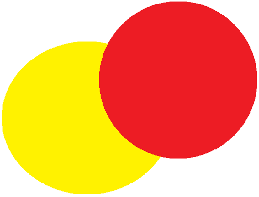

  

<h1 align="center">Connect 4</h1>

This repository contains a full-stack project that aims to recreate the functionality of [chess.com](https://www.chess.com) but with a twist: instead of chess, it focuses on the game of Connect 4. The project incorporates intelligent agents capable of competing against human players.

## Features
* Play Connect 4: Enjoy the classic game of Connect 4 through a user-friendly interface.
* Intelligent Agents: Challenge and compete against intelligent agents specifically designed to provide challenging gameplay.
* Customization: Provide options for users to customize their profiles, avatars, game settings, and more.
* User Authentication: Allow users to create accounts, log in, and authenticate their identity.

## Technologies Used
- Front-end
  - HTML, CSS, Javascript,
  - jQuery
- Back-end
  - Node.js
  - Express, EJS
  - mongoose
  - Cookies, Sessions, bcrypt
- Database:
  - MongoDB

## How It Works
- The user interface is built using HTML, CSS, JavaScript, and jQuery. These technologies are used to create an interactive interface that allows users to play the Connect 4 game with proper game logic.
- Express.js, a web application framework for Node.js, is employed to handle requests and routes in the project. It enables the creation of routes such as the game page, authentication page, and facilitates communication between the game and the intelligent agent for turn notifications.
- MongoDB is utilized to store all user information and the history of previous games. It serves as the database for persistent data storage, ensuring user data and game history can be saved and retrieved.
- User authentication and authorization are implemented using bcrypt, session management, and cookies. Bcrypt is used for secure password hashing and verification. Session management and cookies help maintain user sessions and provide authentication tokens, allowing users to access protected features and ensuring secure authorization.
 
## Installation
To run this project locally follow these steps:
1. clone the repository: `git clone https://github.com/eitancohen77/Man-vs-Machine-Connect-4-edition`
2. Install all the packages: `npm install`
3. Start the MongoDB server:
    - Make sure MongoDB is installed on your system. If not, refer to the [MongoDB](https://www.mongodb.com/) documentation
    - Open the terminal and start the MongoDB server: `mongod`
4. Start the application: `node app.js`
